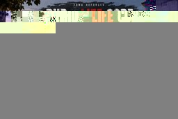

# RHD - LifeCore

**Author: LT. Toad**  
An Arma 3 Life RP framework for persistent people, jobs, crime and opportunity. Built for **3DEN-first mission editing** and organized so a new server owner can change important gameplay values without understanding every SQF system.

## Required dependencies

| Dependency | Required for | Steam Workshop ID |
|---|---|---:|
| **Arma 3** | Base game | — |
| **CBA_A3** | cTab+ and shared mod support | `450814997` |
| **cTab+** | RHD player tablet | `2262006564` |
| **ACE3** | ACE interaction layer and RHD administration | `463939057` |

Workshop links and installation details are maintained in `STEAM_WORKSHOP_DEPENDENCIES.md`.

**Important:** Antistasi Ultimate is **not** a runtime dependency of RHD - LifeCore. RHD contains an RHD-owned district pressure system inspired by persistent-world concepts from Antistasi Ultimate.

## Branding

Mission identity is **RHD - LifeCore** and the mission author is **LT. Toad**. The supplied Kavala artwork is used as the mission loading screen and overview artwork and is stored at `assets/branding/RHDLifeCore.jpg`.

## What is included

- Persistent player identity, cash/bank, inventory, licenses, job and jail state.
- cTab-backed RHD player tablet for status, jobs, shop, banking, services and district pressure.
- F6/F7/F8 shortcuts route into the same cTab-backed player surface.
- ACE Self Actions can open the player tablet without requiring an RHD inventory item.
- Separate UID-gated administrator panel based on the compact XEAT-style player/action layout.
- Farming: Apples, Cannabis Plant, Coca Leaf, Corn Cob, Grapes, Peaches.
- Mining: Iron Ore, Copper Ore, Gold Ore, Diamond, Oil Sand.
- Refining: Iron Ore -> Iron, Copper Ore -> Copper, Gold Ore -> Gold, Oil Sand -> Oil.
- Generic buy/sell shop system using the centralized RHD economy configuration.
- Police, EMS and civilian job templates with basic ticketing and treatment.
- Terrain-independent bank, shop, fuel, farm, mine and refinery locations.
- Performance-conscious ambient civilians, traffic and temporary roadside incidents.
- Server-authoritative transactions with caller validation and anti-negative-money/inventory checks.
- Persistent **district pressure** using `rhd_zone_*` markers with heat, supply, local police presence and control states.
- No hard-coded terrain coordinates.

## Antistasi Ultimate-inspired conflict layer

Antistasi Ultimate is a persistent Arma 3 multiplayer scenario focused on guerrilla warfare and expanded persistent gameplay. RHD uses that *style of persistent world pressure* as design inspiration for its own **Conflict** layer.

The RHD implementation provides:

- `rhd_zone_*` markers that define districts in Eden.
- District criminal/public-order **heat** from 0-100.
- Nearby Police jobs that reduce heat over time.
- `ORDERLY`, `CONTESTED` and `CRIMINAL PRESSURE` district states.
- A district supply value for future jobs and events.
- Server-side `RHD_fnc_recordCrime` support for adding pressure from gameplay systems.
- A **DISTRICTS** page in the player cTab tablet.

The implementation is RHD-owned SQF. It does **not** load Antistasi Ultimate PBOs or require Antistasi Ultimate to run.

## Licensing / third-party code

The main Antistasi Ultimate project is MIT licensed, but its repository also identifies some integrated components as separately licensed APL-ND material. RHD does not copy or modify those restricted components. See `THIRD_PARTY_NOTICES.md` for the exact integration boundary and attribution.

## Beginner editing

### The one file most server owners should edit

`core/fn_init.sqf`

This file contains clearly labeled sections for:

- Admin Steam64 IDs
- Job names and pay rates
- Item names and prices
- Refining recipes
- Gatherable resources
- Conflict/district settings

The comments directly above each section explain the format.

### Map editing

Do map work in **Arma 3 Eden (3DEN)**. Use `3DEN_SETUP.md` for marker names and the recommended town layout.

### Advanced files

Experienced developers can work directly in:

- `core/admin/` — administrator actions
- `core/ace/` — ACE3 integration
- `core/ui/` — cTab player UI
- `core/conflict/` — district pressure / world conflict
- `core/economy/` — shop transactions
- `core/bank/` — banking
- `core/jobs/` — jobs
- `core/industry/` — gathering/refining
- `core/rp/` — police/EMS/RP
- `core/services/` — vehicle services
- `core/ambient/` — ambient population/events

`description.ext` registers these systems and is commented for advanced editors, but most customization should be done through `core/fn_init.sqf` and Eden.

## cTab+

RHD uses [cTab+](https://github.com/jetelain/cTab) as the player-facing tablet surface. The mission opens cTab's `cTab_Tablet_dlg` through its mission-facing function and places RHD-owned controls on that display.

cTab+ requires CBA_A3. Keep cTab+ installed as an external Workshop mod; do not copy its PBOs into this mission.

## ACE3

RHD detects ACE3 at runtime. ACE supplies the interaction layer for the RHD Life Tablet, RHD Administration and contextual EMS actions. RHD keeps LifeCore business rules and privileged validation on the server.

## Administration

All RHD administrator controls are consolidated into one `RHD - LIFECORE | ADMIN` screen. Administrators are identified by Steam64 UID, not player name.

Edit the `RHD_ADMIN_UIDS` section in `core/fn_init.sqf` and add trusted Steam64 IDs.

The administrator surface includes player inspection, heal/kill/freeze, teleport, spectate, cash/bank edits, item/job assignment, vehicle repair/refuel/spawn/delete, world time/weather and server announcements.

Admin access is deliberately separate from the player tablet: no inventory item and no dedicated admin hotkey are required.

## 3DEN marker conventions

Use these marker prefixes in Eden:

- `rhd_farm_*` — farming areas
- `rhd_mine_*` — mining areas
- `rhd_refine_*` — refining areas
- `rhd_shop_*` — shops
- `rhd_bank_*` — banks/ATMs
- `rhd_fuel_*` — fuel stations
- `rhd_zone_*` — persistent district/conflict areas
- `rhd_garage_*` — reserved for future garage expansion
- `rhd_spawn_*` — reserved spawn locations
- `rhd_jail_*` — jail area

No terrain coordinates are hard-coded.

## Installation

1. Install Arma 3.
2. Subscribe to **CBA_A3**, **ACE3**, and **cTab+** on Steam Workshop.
3. Open `STEAM_WORKSHOP_DEPENDENCIES.md` for the current IDs and links.
4. Create the mission in Eden on your chosen terrain.
5. Copy the RHD mission files into the mission folder.
6. Edit `core/fn_init.sqf` and add your trusted admin Steam64 IDs.
7. Place the RHD markers described in `3DEN_SETUP.md`.
8. Save the mission in Eden so `mission.sqm` is generated/updated.
9. Test in local multiplayer.
10. Test again on a dedicated server before publishing.

The released mission does not depend on `-filePatching`; use file patching only for development when needed.
